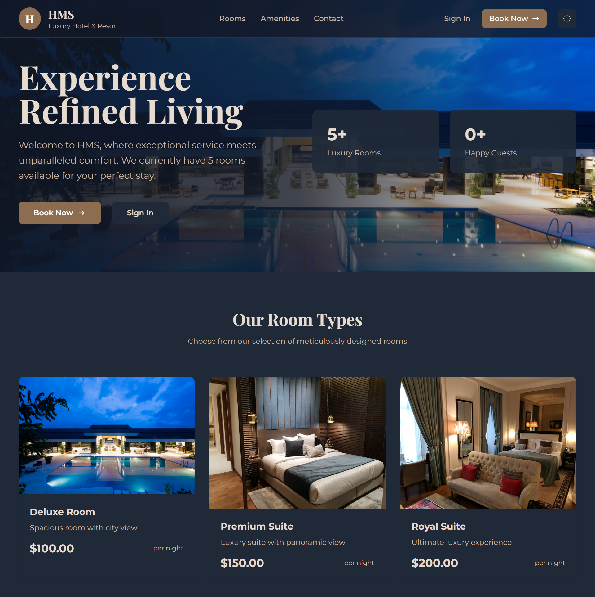
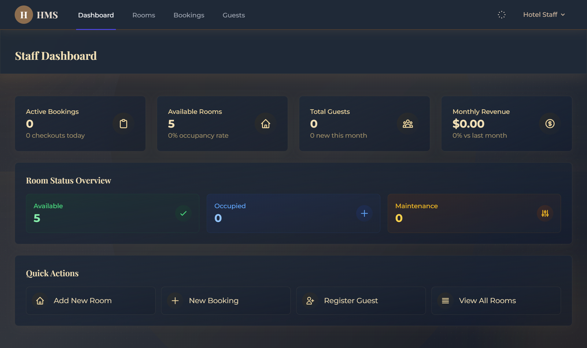
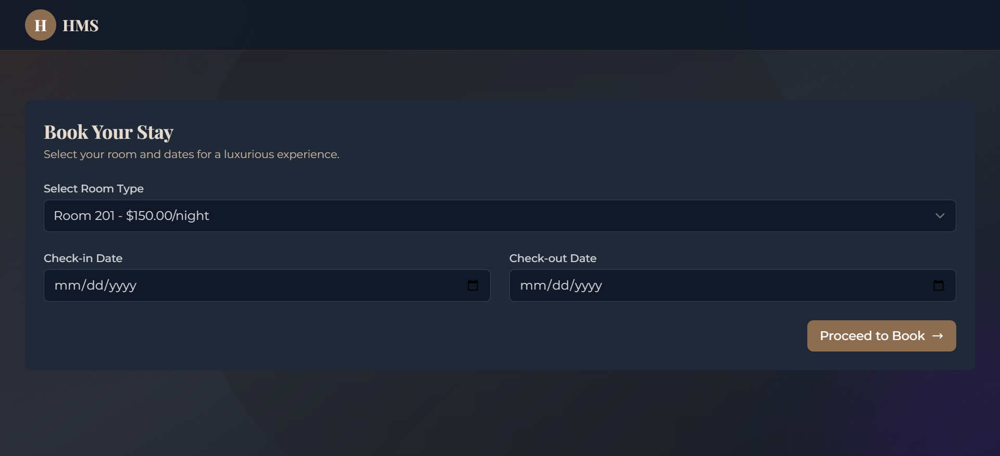

# Hostel Management System (HMS)

[](https://laravel.com)
[](https://php.net)
[](https://mysql.com)
[](https://tailwindcss.com)
[](https://github.com/1yakub/Hostel-Management-System-HMS-/actions/workflows/laravel.yml)

## 🌐 Live Demo

🎯 **Try the application:** [**Live Demo**](https://your-hms-demo.up.railway.app) *(Coming Soon)*

**Demo Accounts:**
- 👨‍💼 **Staff:** `staff@example.com` / `password`
- 👤 **Guest:** `guest@example.com` / `password`

---

A comprehensive web-based hostel management solution developed during an internship at Varygen Corp Ltd. This system streamlines hostel operations through automated booking management, room tracking, and integrated payment processing.

## 🏢 Project Overview

**Developer:** Md Yakub Hossain  
**Student ID:** 1830968  
**Institution:** Independent University, Bangladesh  
**Company:** Varygen Corp Ltd  
**Duration:** Spring 2025 (3 months)  
**Academic Supervisor:** Razib Hayat Khan, Ph.D.  
**Industry Supervisor:** Bimasha Zaman (CEO, Varygen Corp Ltd)

## 📋 Table of Contents

- [Live Demo](#-live-demo)
- [Features](#-features)
- [Technology Stack](#️-technology-stack)
- [System Architecture](#️-system-architecture)
- [Prerequisites](#-prerequisites)
- [Installation](#-installation)
- [Deployment](#-deployment)
- [User Roles & Access](#-user-roles--access)
- [Testing](#-testing)
- [Performance Metrics](#-performance-metrics)
- [Security Features](#-security-features)
- [Screenshots](#-screenshots)
- [Future Enhancements](#-future-enhancements)
- [Contact](#-contact)

## ✨ Features

### 🔐 Authentication & Authorization
- Secure user authentication with Laravel Breeze
- Role-based access control (Admin, Staff, Guest)
- Password reset and email verification
- Session management with timeout

### 🏠 Room Management
- Real-time room inventory tracking
- Dynamic pricing and availability updates
- Room maintenance status management
- Amenities tracking through JSON storage
- Room type categorization

### 📅 Booking System
- Advanced booking management with date validation
- Check-in/check-out processing
- Room availability checking
- Booking modification and cancellation
- Special requests handling

### 💳 Payment Processing
- Secure payment tracking and verification
- Automated invoice generation
- Payment history maintenance
- Financial transaction reporting

### 👥 Guest Management
- Guest registration and profiling
- Document verification system
- Contact information management
- Guest history tracking

### 📊 Reporting & Analytics
- Occupancy and revenue reports
- Performance metrics dashboard
- Business intelligence features
- Real-time operational statistics

## 🛠️ Technology Stack

### Backend
- **Framework:** Laravel 11.x
- **Language:** PHP 8.2+
- **Database:** MySQL/SQLite
- **ORM:** Eloquent
- **Authentication:** Laravel Breeze

### Frontend
- **Markup:** HTML5
- **Styling:** Tailwind CSS with custom luxury theme
- **Scripting:** JavaScript, Alpine.js
- **Build Tool:** Vite
- **Responsive Design:** Mobile-first approach

### Development Tools
- **Dependency Management:** Composer, npm
- **Version Control:** Git
- **Testing:** PHPUnit
- **Code Standards:** PSR-12

## 🏗️ System Architecture

The HMS follows a modern MVC architecture pattern:

- **Model Layer:** Database interactions and business logic using Eloquent ORM
- **View Layer:** Blade templates with responsive Tailwind CSS components
- **Controller Layer:** RESTful controllers for request handling

### Key Design Patterns
- MVC (Model-View-Controller)
- Repository Pattern through Eloquent
- Middleware Pattern for authentication
- Dependency Injection via Laravel's service container

## 📋 Prerequisites

- PHP >= 8.2
- Composer
- Node.js & npm
- MySQL >= 5.7 (or SQLite for development)
- Web server (Apache/Nginx)

## 🚀 Installation

1. **Clone the repository**
   ```bash
   git clone https://github.com/1yakub/Hostel-Management-System-HMS-.git
   cd Hostel-Management-System-HMS-
   ```

2. **Install PHP dependencies**
   ```bash
   composer install
   ```

3. **Install Node.js dependencies**
   ```bash
   npm install
   ```

4. **Environment setup**
   ```bash
   cp .env.example .env
   php artisan key:generate
   ```

5. **Configure database**
   
   For MySQL:
   ```env
   DB_CONNECTION=mysql
   DB_HOST=127.0.0.1
   DB_PORT=3306
   DB_DATABASE=hostel_management
   DB_USERNAME=your_username
   DB_PASSWORD=your_password
   ```
   
   For SQLite (default):
   ```env
   DB_CONNECTION=sqlite
   DB_DATABASE=/absolute/path/to/database/database.sqlite
   ```

6. **Run migrations and seeders**
   ```bash
   php artisan migrate --seed
   ```

7. **Build frontend assets**
   ```bash
   npm run build
   ```

8. **Start the development server**
   ```bash
   php artisan serve
   ```

Visit `http://localhost:8000` to access the application.

## 🚀 Deployment

### Deploy to Railway (Recommended)

Railway provides excellent Laravel hosting with a generous free tier:

1. **Sign up at [Railway](https://railway.app)**

2. **Click "Deploy from GitHub"** and select this repository

3. **Add environment variables:**
   ```env
   APP_NAME=HMS
   APP_ENV=production
   APP_DEBUG=false
   APP_URL=https://your-app-name.up.railway.app
   DB_CONNECTION=pgsql
   # Database variables will be auto-populated by Railway
   ```

4. **Railway will automatically:**
   - Install dependencies (`composer install`)
   - Build assets (`npm run build`)
   - Run migrations (`php artisan migrate --force`)
   - Seed database (`php artisan db:seed --force`)

5. **Your demo will be live** at `https://your-app-name.up.railway.app`

### Deploy to Render

1. **Fork this repository** to your GitHub account

2. **Sign up at [Render](https://render.com)**

3. **Create a new Web Service** from your GitHub repo

4. **Configure build & start commands:**
   - **Build Command:** `composer install --no-dev && npm ci && npm run build`
   - **Start Command:** `php artisan migrate --force && php artisan serve --host=0.0.0.0 --port=$PORT`

5. **Add environment variables** similar to Railway setup

### Deploy to Heroku

1. **Install Heroku CLI** and login

2. **Create Heroku app:**
   ```bash
   heroku create your-hms-demo
   heroku addons:create heroku-postgresql:mini
   ```

3. **Configure environment:**
   ```bash
   heroku config:set APP_ENV=production
   heroku config:set APP_DEBUG=false
   heroku config:set APP_KEY=$(php artisan --show-key)
   ```

4. **Deploy:**
   ```bash
   git push heroku main
   ```

### Production Environment Setup

**Required Environment Variables:**
```env
APP_NAME=HMS
APP_ENV=production
APP_DEBUG=false
APP_URL=https://your-domain.com
DB_CONNECTION=pgsql
SESSION_DRIVER=database
CACHE_DRIVER=database
QUEUE_CONNECTION=database
LOG_LEVEL=error
```

**Demo Credentials:**
- **Staff:** `staff@example.com` / `password`
- **Guest:** `guest@example.com` / `password`

## 👤 User Roles & Access

### Administrator
- Complete system oversight
- User management
- Financial reporting
- System configuration

### Staff Members
- Daily operational management
- Guest service coordination
- Room and facility maintenance
- Booking management

### Guests
- Online booking and payment
- Service requests
- Stay management
- Profile updates

## 🧪 Testing

Run the test suite:
```bash
php artisan test
```

### Test Coverage
- Authentication testing
- Room management operations
- Booking system functionality
- Payment processing
- API endpoints

## 🔄 CI/CD Pipeline

This project includes automated GitHub Actions workflow that:

- ✅ **Runs automatically** on every push/pull request to `main`
- 🐘 **Tests with PHP 8.2** and Laravel 11
- 🗃️ **Uses SQLite** for fast testing
- 📦 **Installs dependencies** (Composer & NPM)
- 🧪 **Executes all tests** (PHPUnit/Pest)
- 🎨 **Builds frontend assets** (Vite/Tailwind)
- 📊 **Reports status** via GitHub badge

**View CI/CD Results:** [GitHub Actions](https://github.com/1yakub/Hostel-Management-System-HMS-/actions)

## 📊 Performance Metrics

- **Response Time:** < 2 seconds average page load
- **Concurrent Users:** Successfully tested with 100+ simultaneous users
- **Database Operations:** < 100ms average query execution
- **API Response:** < 200ms REST endpoint response time

## 🔒 Security Features

- XSS protection
- CSRF token verification
- SQL injection prevention
- Role-based access control
- Data encryption for sensitive information
- Session security with timeout

## 📱 Screenshots

<div align="center">

### 🏠 Landing Page

*Modern, responsive landing page with room showcase and booking interface*

### 📊 Staff Dashboard

*Comprehensive dashboard with real-time statistics and quick actions*

### 🏨 Room Management

*Intuitive room management interface with status tracking*

### 📅 Booking Interface

*User-friendly booking system with date validation and room selection*

</div>

## 🚧 Future Enhancements

### Technical Improvements
- [ ] Mobile application development (iOS/Android)
- [ ] AI-powered room recommendations
- [ ] Advanced analytics with predictive modeling
- [ ] Real-time chat support
- [ ] Third-party booking platform integration

### Business Features
- [ ] Loyalty program integration
- [ ] Dynamic pricing system
- [ ] Multi-language support
- [ ] Advanced reporting tools

## 📄 Project Documentation

For detailed technical documentation, please refer to the [full internship report](docs/1830968_hms_report.pdf).

## 🤝 Contributing

This project was developed as part of an academic internship. For educational purposes and learning:

1. Fork the repository
2. Create a feature branch (`git checkout -b feature/amazing-feature`)
3. Commit changes (`git commit -m 'Add amazing feature'`)
4. Push to branch (`git push origin feature/amazing-feature`)
5. Open a Pull Request

## 📝 License

This project is developed for academic and learning purposes. Please contact the author for usage permissions.

## 📞 Contact

<div align="center">

### 👨‍💻 **Md Yakub Hossain**
*Computer Science & Engineering Student*  
*Independent University, Bangladesh*

[](mailto:1830968@iub.edu.bd)
[](https://linkedin.com/in/yakubhossain)
[](https://github.com/1yakub)

---

### 👨‍🏫 **Academic Supervisor**
**Razib Hayat Khan, Ph.D.**  
Associate Professor, CSE Department  
Independent University, Bangladesh

---

### 👩‍💼 **Industry Supervisor**
**Bimasha Zaman**  
CEO, Varygen Corp Ltd

</div>

## 🙏 Acknowledgments

- **Varygen Corp Ltd** for providing the internship opportunity
- **Bimasha Zaman** (CEO, Varygen Corp Ltd) for industry guidance and mentorship
- **Razib Hayat Khan, Ph.D.** for academic supervision and support
- **Independent University, Bangladesh** for academic framework and resources
- **Department of Computer Science & Engineering** for comprehensive education

## 📈 Project Stats


---

<div align="center">

**⭐ Star this repository if you found it helpful!**

*This system was developed as part of an undergraduate internship program and demonstrates the practical application of modern web development technologies in solving real-world business challenges.*

</div>
