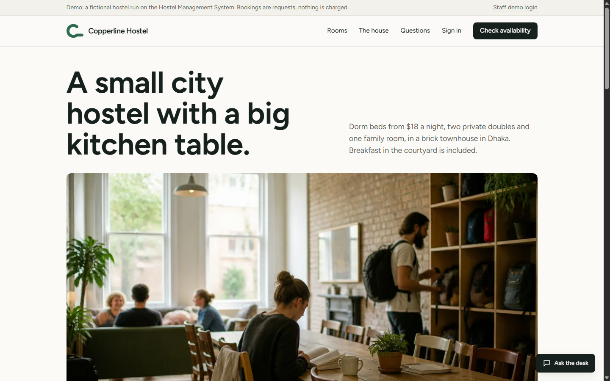

# Hostel Management System

A Laravel application that runs a small hostel: a public site with live availability and
booking requests, a front desk for staff, a guest area, and a website assistant that
answers questions from the hostel's own data.

Live demo: **[hms.yakubhossain.dev](https://hms.yakubhossain.dev)**. The demo runs as the
fictional Copperline Hostel. Bookings are requests only, nothing is charged, and the
database resets every night.



## What it does

**Public site**

- Live availability search: check in, check out and party size, checked against real
  bookings with overlap logic. Free bed counts on the home page come from the database.
- Room types grouped from the room table: dorm beds, private doubles, a family room.
- Booking requests. A visitor makes an account, requests a stay, and sees its status.
- Questions people ask, hours, address and contact from one configuration file.
- "Ask the desk", a website assistant. It answers questions about beds, prices and the
  house with read only tools. It cannot book, change or delete anything.

**Front desk**

- Dashboard with live counts: guests in house, arrivals today, departures today, free beds.
- Rooms: create, edit, status, featured photo.
- Bookings: create for a party, confirm, check in, check out. Capacity and overlap are
  checked before a booking is saved. A checkout completes the whole party and frees the
  room only when nothing else occupies it that day.
- Guests: records linked to user accounts when the guest booked through the site.

**Guest area**

- My bookings, one booking request form that pre fills from the search, and the profile
  pages from Laravel Breeze.

## Stack

| Layer | Choice |
| --- | --- |
| Framework | Laravel 13, PHP 8.4 |
| Front end | Blade, Tailwind CSS 4, Alpine.js 3, Vite 8 |
| Authentication | Laravel Breeze |
| Assistant | Laravel AI SDK with the OpenAI compatible driver against Vertex AI |
| Database | PostgreSQL in production, SQLite for local work and tests |
| Runtime | serversideup/php 8.4 (nginx and php-fpm) |
| Hosting | Docker image on GHCR, deployed by Coolify |

One typeface (Figtree), one colour system, one set of Blade components for site and desk.
The rules are written down in [docs/design-system.md](docs/design-system.md).

## The assistant, and how it is kept safe

The assistant is the only part of the application that spends money, so it has the most
guards.

- **Credentials stay out of the browser and the repository.** A Google service account with
  one role (`roles/aiplatform.user`) is mounted as a file outside the image. The server
  mints a short lived access token from it and caches the token for fifty minutes.
- **Read only tools.** The model can call three functions: check availability, list room
  types, read hostel facts. There is no tool that writes.
- **Four layers of limits.** A per address throttle (6 requests a minute, 12 in ten
  minutes), a per session daily cap (30 answers), a site wide daily cap (400 answers),
  and a hard limit on input length (500 characters), output length (600 tokens) and tool
  steps (3). When a cap is reached the widget shows a plain message. No stack trace, no
  provider error ever reaches the visitor.
- **Automatic failover.** Two models are configured on the same endpoint. If the first
  one is rate limited or errors, the SDK retries with the second.
- **Text only rendering.** Answers are rendered as text. Nothing the model returns is
  treated as HTML.
- **Short memory.** Six turns of history per session, in the server session, never in the
  browser.

Provider, models and limits live in `config/ai.php` and `config/hms.php`. Set
`HMS_ASSISTANT_ENABLED=false` to remove the widget and the route.

## Security, in framework terms

Every protection is a Laravel mechanism or a maintained package, not a hand written check.

- Three areas, three prefixes: the public site at `/`, a guest's own space under `/my`, the
  staff desk under `/desk`.
- The desk is gated by an `access-desk` Gate through the `can` middleware, and each desk
  resource (rooms, guests, bookings) by its Policy, so a guest account gets a 403 on every
  desk URL and verb.
- Every desk write goes through a Form Request; capacity and availability checks are "after"
  validation rules, so the controller only stores.
- Sign in is Breeze with its rate limiter; the assistant has its own limiters and caps.
- A Content Security Policy is set on every response by spatie/laravel-csp with a per
  request nonce shared with the Vite tags; scripts, styles, fonts and images come from this
  origin only, and the page cannot be framed. The remaining headers (nosniff, referrer
  policy, permissions policy) are added by nginx inside the image.

The desk account is part of the public demo on purpose; the data resets every night.

## Run it locally

Requirements: PHP 8.4, Composer, Node 22, or Docker.

```bash
git clone https://github.com/1yakub/Hostel-Management-System-HMS-.git hms
cd hms
cp .env.example .env
composer install
npm install && npm run build
php artisan key:generate
touch database/database.sqlite
php artisan migrate --seed
php artisan serve
```

Open http://127.0.0.1:8000. The seed creates the demo hostel, nine rooms, six guests and
nine bookings around today's date. Demo sign ins are printed by the seeder; the password
comes from `HMS_DEMO_PASSWORD` in `.env`.

The assistant needs a Vertex AI project and a service account key. Set `VERTEX_OPENAI_URL`,
`VERTEX_SA_KEY_PATH` (or `VERTEX_SA_KEY_BASE64`) and keep `HMS_ASSISTANT_ENABLED=true`.
Without a key the rest of the site runs normally and the widget is hidden.

## Tests

```bash
php artisan test
```

Forty feature tests run against an in memory SQLite database: availability and overlap
rules, desk booking rules, checkout, guest linking, the assistant's caps and input limits,
and the disabled mode.

## Deploy

The repository builds a production image on every push to `main`:

1. `Tests` runs the suite on PHP 8.4.
2. `Build and push image` builds a multi architecture image (arm64 and amd64) from the
   `Dockerfile` and pushes it to `ghcr.io/1yakub/hms`.
3. `Deploy` asks Coolify to pull the new image and restart.

The image runs as `www-data`, with opcache on, and at boot it caches configuration,
routes and views and runs migrations. Configuration comes from environment variables, the
service account key from a file mount at `/run/secrets/vertex-sa.json`. Behind the
platform proxy the application trusts forwarded headers so it sees `https` and the real
client address.

For a different host: build with `docker build -t hms .`, run with the variables from
`.env.example`, point `DB_*` at PostgreSQL, and mount the key file.

## Repository layout

```
app/Ai/            the assistant agent and its three tools
app/Support/       Availability (overlap logic), VertexToken (token minting)
app/Http/          controllers for the site, the desk, the guest area, the assistant
config/hms.php     hostel facts, FAQ, assistant limits
database/          migrations and the demo seeders
docs/              design system
resources/views/   Blade: site layout, desk layout, components
tests/Feature/     the test suite
```

## History

The first version was written in 2025 as an internship project. In September 2026 it was
rebuilt: framework and tooling brought current, the data model corrected (bookings now
belong to guests), availability and capacity rules added with tests, the public site and
the desk redesigned on one design system, the assistant added, and the deployment moved to
a container image.

## License

MIT. See [LICENSE](LICENSE).
